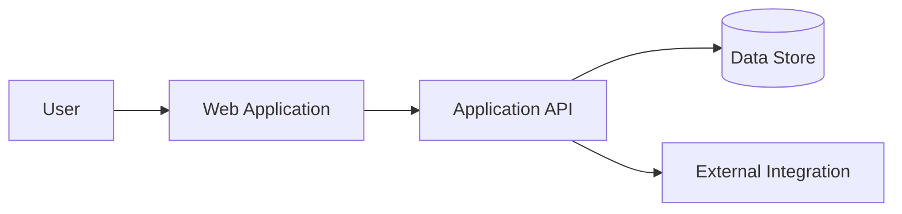

# Case Study Template

Use this template for public project case studies. Remove instructional comments before publication.

---

## Publication record

| Field | Value |
| --- | --- |
| Working title |  |
| Public title |  |
| Project name approved | Yes / No / Not applicable |
| Neutral title |  |
| Publication state | Draft / Review / Approved / Blocked |
| Confidentiality | Public / Redacted / Approval required / Private |
| Owner | Shaedan Hawse |
| Factual review date |  |
| Confidentiality review date |  |
| Evidence record IDs |  |

## Executive summary

<!-- In two or three sentences, explain the system, Shaedan's responsibility, and the most important verified outcome or engineering value. -->

## At a glance

| Area | Detail |
| --- | --- |
| Domain |  |
| Engagement |  |
| Actual role or title |  |
| Contribution |  |
| Collaboration |  |
| Stack |  |
| Status |  |
| Public repository |  |
| Live system |  |

## Business context

<!-- What did the organization or user need? Explain the environment without disclosing confidential business information. -->

## Problem

<!-- Describe the concrete problem. Avoid rewriting the solution as the problem. -->

## Constraints

<!-- Include technical, organizational, timeline, budget, compatibility, data, security, operational, and handoff constraints. -->

- 

## What must never happen

<!-- Define the system's negative space. These invariants should make failure boundaries explicit. -->

- Never 
- Never 
- Never 

## Ownership and collaboration

### Shaedan's responsibilities

<!-- Use contribution language supported by evidence. -->

- 

### Collaborators and stakeholders

<!-- State where decisions or implementation were shared. Do not imply sole ownership when work was collaborative. -->

- 

## Architecture

<!-- Add a publication-safe diagram and explain the major boundaries. Generalize hostnames, account identifiers, secret locations, and sensitive topology. -->

### Components

| Component | Responsibility | Failure behavior |
| --- | --- | --- |
|  |  |  |

### Data flow

<!-- Explain the primary flow and identify source-of-truth boundaries. -->

## Key decisions

### Decision: <title>

**Context**

<!-- What forced a choice? -->

**Options considered**

1. 
2. 
3. 

**Decision**

<!-- What was chosen? -->

**Why**

<!-- Explain the tradeoff, not merely the implementation. -->

**Consequences**

- Positive: 
- Negative: 
- Follow-up: 

## Rejected alternatives

<!-- Show judgment without attacking reasonable alternatives. State when new evidence could change the decision. -->

| Alternative | Why it was not selected | Condition that could change the decision |
| --- | --- | --- |
|  |  |  |

## Security and privacy

<!-- Describe threat boundaries, validation, authorization, secret handling, auditability, and data minimization at a safe level. -->

### Security invariants

- Never trust 
- Never expose 
- Never accept 

### Sensitive details intentionally omitted

- 

## Accessibility and user experience

<!-- Describe semantic structure, keyboard behavior, focus, contrast, touch, responsive behavior, reduced motion, error states, and graceful degradation. -->

## Testing and validation

| Layer | What was validated | Evidence |
| --- | --- | --- |
| Unit |  |  |
| Integration |  |  |
| End to end |  |  |
| Accessibility |  |  |
| Performance |  |  |
| Security |  |  |
| Manual |  |  |

## Deployment and operations

<!-- Explain environments, CI/CD, configuration boundaries, observability, failure visibility, rollback, and ownership without exposing production identifiers. -->

### Deployment invariants

- Never deploy when 
- Never replace 
- Never hide 

### Recovery and rollback

<!-- What can fail, how is it detected, and how is the system restored? -->

## Outcomes

Only include verified values.

| Outcome | Verified result | Measurement method | Evidence ID |
| --- | --- | --- | --- |
|  |  |  |  |

When a business metric is unavailable, use evidence-backed scope or engineering outcomes instead of inventing a number.

## Difficult failure or incident

<!-- Optional. Explain diagnosis, containment, correction, and prevention. Do not reveal an unpatched vulnerability or confidential incident detail. -->

### Symptom

### Investigation

### Root cause

### Resolution

### Prevention

## Lessons learned

<!-- What did the work change about future engineering decisions? -->

- 

## What I would improve next

<!-- Show judgment and humility. Separate immediate debt from speculative enhancements. -->

1. 
2. 
3. 

## Public-safe evidence

<!-- Link only to evidence approved for publication. Private evidence remains in the private ledger. -->

- 

## Publication checklist

- [ ] The title and client name are approved or generalized.
- [ ] Shaedan's contribution is accurate.
- [ ] Collaboration is attributed.
- [ ] Every material claim maps to evidence.
- [ ] Every displayed metric is verified.
- [ ] Diagrams are sanitized.
- [ ] Screenshots contain synthetic or approved data.
- [ ] No secret, private contact detail, internal hostname, or exploit-enabling detail is present.
- [ ] Metadata, image filenames, alt text, and structured data use the approved public title.
- [ ] AI-assisted text received factual and confidentiality review.
- [ ] The case study is useful without access to private source code.
